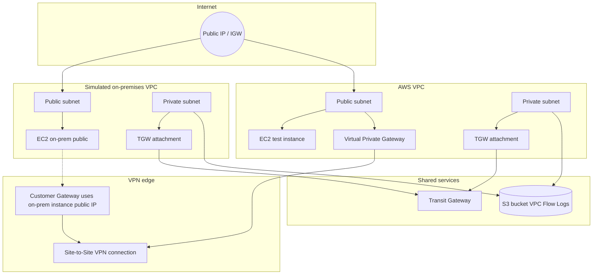
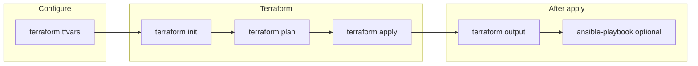

# Automated-Hybrid-Cloud-Networking

Infrastructure-as-code lab for a **simulated hybrid cloud** on AWS: two VPCs in one account represent “cloud” and “on-premises,” with VPN, Transit Gateway, Network Firewall artifacts, and VPC Flow Logs to S3. Provisioning is **Terraform**; **Ansible** optional post-deploy tooling.

**Author:** [sribokka8](https://github.com/sribokka8)

**Stack:** [AWS](https://aws.amazon.com) · [Terraform](https://www.terraform.io) · [Ansible](https://www.ansible.com)

---

## Overview

This repository deploys:

| Layer | What Terraform creates |
|--------|-------------------------|
| **Networking** | Two VPCs with DNS support; public and private subnets per VPC; Internet Gateways; route tables for public subnets (default route to IGW). |
| **Compute** | Two Amazon Linux 2 EC2 instances: one in the “AWS” public subnet, one in the “on-prem” public subnet (labeled VPN server). |
| **Security groups** | AWS instance: SSH from `my_ip`, ICMP from anywhere. On-prem instance: UDP 500/4500 for IPsec; no SSH rule in `vpn_sg` (SSH to that host would require additional rules). |
| **VPN** | Virtual Private Gateway on the AWS VPC, Customer Gateway targeting the on-prem instance public IP, Site-to-Site VPN connection (IPsec, static routes only). |
| **Transit Gateway** | TGW plus VPC attachments on the **private** subnets of both VPCs. |
| **Network Firewall** | Stateful rule group (drop TCP/22) and a firewall **policy** referencing it. There is no `aws_networkfirewall_firewall` resource (no firewall subnets or traffic steering in this repo). |
| **Observability** | S3 bucket (random name prefix `flow-logs-`), bucket policy for Flow Logs delivery, VPC Flow Logs (ALL traffic) for **both** VPCs to that bucket. |

Additional narrative layout: [docs/ARCHITECTURE.md](docs/ARCHITECTURE.md).

### Logical topology (high level)



> Routing, VPN tunnel establishment, and Network Firewall **traffic steering** are not fully defined in this repository; the diagram reflects **resources Terraform declares**, not guaranteed production traffic paths.

---

## Network layout (intended vs defaults)

Subnets are derived with `cidrsubnet(<vpc_cidr>, 8, 1)` and `(..., 8, 2)`:

- **“AWS” VPC** (`aws_vpc_cidr`, default `10.0.0.0/16`): public `10.0.1.0/24`, private `10.0.2.0/24` (when using the default CIDR).
- **“On-prem” VPC** (`onprem_vpc_cidr`): same formula — e.g. if set to `192.168.0.0/16`, you get `192.168.1.0/24` and `192.168.2.0/24`.

**Important:** In `variables.tf`, `onprem_vpc_cidr` defaults to `10.0.0.0/16`, which **overlaps** the AWS VPC. For a valid lab, set `onprem_vpc_cidr = "192.168.0.0/16"` (or another non-overlapping RFC1918 range) in `terraform.tfvars`.

Availability zones: AWS subnets use `${region}a`; on-prem subnets use `${region}b`.

---

## Repository layout

```
Automated-Hybrid-Cloud-Networking/
├── terraform/          # All AWS resources (provider, VPC, EC2, VPN, TGW, firewall policy, flow logs)
│   ├── main.tf
│   ├── vpc.tf
│   ├── vpn.tf
│   ├── tgw.tf
│   ├── firewall.tf
│   ├── flowlogs.tf
│   ├── variables.tf
│   ├── outputs.tf
│   └── terraform.tfvars    # Local overrides (not committed if gitignored; create your own)
├── ansible/
│   ├── playbook.yml        # Installs traceroute (see Ansible notes below)
│   └── inventory.ini       # Example / placeholder — replace hosts after apply
└── docs/
    └── ARCHITECTURE.md
```

---

## Prerequisites

- AWS account and IAM credentials usable by the Terraform AWS provider (environment variables, shared config, or another [standard auth method](https://registry.terraform.io/providers/hashicorp/aws/latest/docs#authentication-and-configuration)).
- [Terraform](https://developer.hashicorp.com/terraform/install) **1.x** (project pins providers in `.terraform.lock.hcl`; run `terraform init` to sync).
- [Ansible](https://docs.ansible.com/ansible/latest/installation_guide/index.html) if you use the playbook.
- An **EC2 key pair** already created in the target region; reference its name in `ssh_key_name`.

---

## Configure Terraform

Create `terraform/terraform.tfvars` (this repo does not ship `terraform.tfvars.example`). Minimal example:

```hcl
aws_region        = "us-east-1"
ssh_key_name      = "your-ec2-key-pair-name"
my_ip             = "203.0.113.10/32"   # your public IPv4 + /32 for SSH to the AWS test instance

# Strongly recommended — avoids overlapping VPC CIDRs with the default:
onprem_vpc_cidr   = "192.168.0.0/16"
```

### Variables (see `terraform/variables.tf`)

| Variable | Purpose | Default (check file for current values) |
|----------|---------|-------------------------------------------|
| `aws_region` | AWS region | `us-east-1` |
| `aws_vpc_cidr` | Cloud VPC CIDR | `10.0.0.0/16` |
| `onprem_vpc_cidr` | Simulated on-prem VPC CIDR | **Overlaps AWS default — override in tfvars** |
| `instance_type` | EC2 size | `t2.micro` |
| `ssh_key_name` | Existing key pair name | set in tfvars |
| `my_ip` | CIDR allowed for SSH (TCP 22) to AWS instance SG | override in tfvars |

---

## Deploy

### Provisioning flow



From the repository root:

```bash
cd terraform
terraform init
terraform plan -out=tfplan
terraform apply tfplan
```

Review planned changes carefully: VPN, Transit Gateway, Network Firewall, and multiple VPC resources can incur cost beyond Free Tier.

### Outputs

After apply:

```bash
terraform output
```

- `aws_instance_ip` — public IP of the EC2 instance in the AWS VPC public subnet.
- `onprem_instance_ip` — public IP of the EC2 instance in the on-prem public subnet (Customer Gateway uses this address).

---

## Ansible (optional)

1. Edit `ansible/inventory.ini`: set `ansible_host` for each host to the **public DNS name or IP** from Terraform outputs (or EC2 console).

2. Run the playbook from the repo root (adjust key path for Windows):

```bash
ansible-playbook -i ansible/inventory.ini ansible/playbook.yml \
  --private-key ~/.ssh/your-key.pem \
  -u ec2-user
```

**Note:** The playbook uses `apt` (Debian/Ubuntu). Terraform uses **Amazon Linux 2** AMIs. Installing `traceroute` on Amazon Linux is typically `sudo yum install -y traceroute` or `dnf`. Expect the playbook to fail unless you switch the module to `yum`/`dnf` or change the AMI family. Update the playbook before relying on it.

---

## Verification ideas

- From your workstation, SSH to the AWS instance (port 22 allowed only from `my_ip`): use the key matching `ssh_key_name`.
- Use `terraform output` to discover addresses; ping/traceroute behavior depends on security groups and actual routing configured in AWS (this repo does not define full VPN/TGW route tables or on-instance VPN daemons).

---

## Tear down

```bash
cd terraform
terraform destroy
```

The Flow Logs S3 bucket uses `force_destroy = true` so demolition can empty the bucket (still verify no data you need).

---

## Limitations (as shipped)

Understanding these avoids false expectations:

1. **Overlapping CIDR default** — Set `onprem_vpc_cidr` to a non-overlapping range before serious testing.
2. **Hybrid connectivity** — VPN/TGW objects exist in Terraform; **full end-to-end routing**, static VPN routes, and IPsec configuration on the EC2 “VPN server” are **not** fully automated here.
3. **Network Firewall** — Rule group and policy only; no firewall endpoint or route tables sending traffic through AWS Network Firewall.
4. **Ansible vs AMI** — Package manager mismatch with Amazon Linux (see above).

---

## License

This repository does not include a `LICENSE` file. Add one if you redistribute or publish the project.
